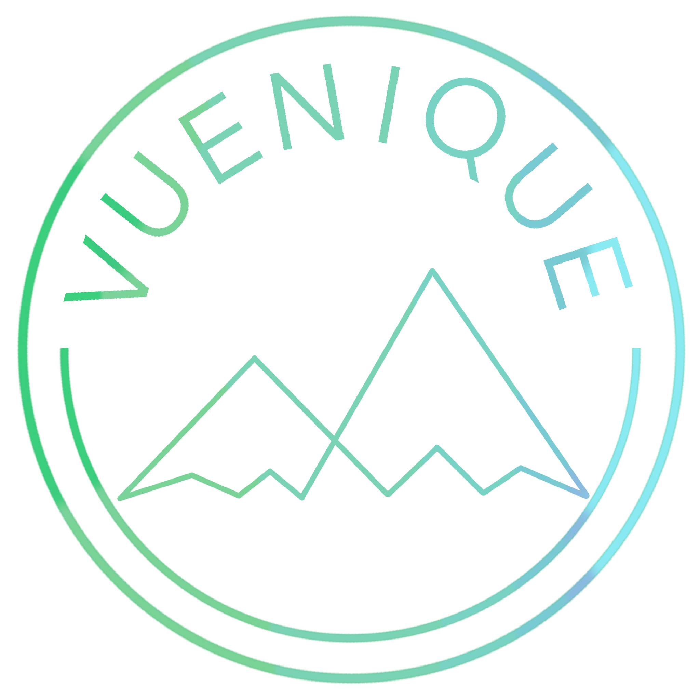

<!-- HEADER -->
<br/>
<p align="center">
   
   <h3 align="center">Vuenique</h3>
   <p align="center">
      A low level visualization component library built for Vue
   </p>

   <!-- BADGES -->
</p>

<hr>

<!-- TABLE OF CONTENTS -->
<details open="open">
   <summary>Table of Contents</summary>
   <ol>
      <li><a href="#introduction">Introduction</a></li>
      <li><a href="#installation">Installation</a></li>
      <li><a href="#getting-started">Getting Started</a></li>
      <li>
         <a href="#documentation">Documentation</a>
         <ul>
            <li><a href="#shape">Shape</a></li>
            <li><a href="#group">Group</a></li>
            <li><a href="#scale">Scale</a></li>
            <li><a href="#legend">Legend</a></li>
         </ul>
      </li>
      <li><a href="#contributing">Contributing</a></li>
      <li><a href="#license">License</a></li>
      <li><a href="#creators">Creators</a></li>
      <li><a href="#acknowledgments">Acknowledgments</a></li>
   </ol>
</details>

<hr>

## Introduction

Vuenique is a reusable low-level component visualization library that brings the power of D3 and visx to Vue

## Installation

Install with npm:

```sh
npm install @vueniquejs/vuenique
```

## Getting Started

1. Import the components you need from the package.

```js
import { Bar } from @vueniquejs/vuenique
```

2. Pass in the necessary props.

```js
<Bar x="5" y="5" />
```

3. See your component render!

Check out our <a href="https://vuenique.net/">gallery</a> for more examples of what you can build.

## Documentation

Vuenique visualization components can be roughly grouped into several categories:

### Shape

These are the building blocks of the framework. Map to shapes you can utilize within your visualizations.

#### `<Bar />`

**Description:** Staple of the bar chart, the component represents a single rectangular bar in your visualization.
<br>

**Inputs:** <br>
_(Optional):_

- className: class to be passed into components class
- any valid attributes (x, y, rx, ry, width, height, etc.) for SVG < rect> elements can be passed through props
  <br/>

**Outputs:** Returns a Vue component wrapped around a < rect> HTML element with any props passed in rendering as attributes on the element

#### `<Circle />`

**Description:** Staple of the scatter plot and other chart types utilizing circles, the component represents a single circle in your visualization
<br/>

**Inputs:** <br>
_(Optional):_

- className: class to be passed into components class
- any valid attributes (cx, cy, r, etc.) for SVG < circle> elements can be passed through props
  <br/>

**Outputs:** Returns a Vue component wrapped around a < circle> HTML element with any props passed in rendering as attributes on the element

#### `<LinePath />`

**Description:** Staple of the line chart, the component represents a single line path in your visualization
<br/>

**Inputs:** <br>
_(Optional):_

- className: class to be passed into components class
- any valid attributes for SVG < path> elements can be passed through props
  <br/>

**Outputs:** Returns a Vue component wrapped around a < path> HTML element with any props passed in

<hr>

### Group

Built around the < g> SVG element, Group acts as a wrapper around Shape components, allowing you to group pieces of a visualization together.

#### `<Group />`

**Inputs:** Props get passed to underlying < g> SVG element are rendered as HTML attributes on element. Components passed as children to Group get rendered within < g> container
<br/>

**Outputs:** Container of Shape components passed a children in the form of < g> element

<hr>

### Scale

Scales package provides wrappers around D3.js library scale packages, which contains functions that help you to map your data into the graph's pixels.

#### `scaleBand()`

**Description:** Provides a wrapper function around the D3 scaleBand() function, projecting discrete values into uniform bands of range.
<br/>

**Inputs:**

- Config: scale object that optionally contains domain, range, round, reverse, align, padding properties.
  <br/>

**Outputs:** Returns an inner function that passes the invocation d3 scaleBand() function and the config object, which will create a new band scale and set the properties according to user input properties in the config object.

#### `scaleLinear()`

**Description:** Provides a wrapper function around the D3 scaleLinear() function, project continuous input values(domain) to out values(range)
<br/>

**Inputs:**

- Config: scale object that optionally contains domain, range, reverse, clamp, interpolate, nice, round, zero, properties.
  <br/>

**Outputs:** Returns an inner function that passes the invocation d3 scaleLinear() function and the config object, which will create a new linear scale and set the properties according to user input properties in the config object.

#### `scaleTime()`

**Description:** Applies D3 scaleTime function to a configuration object to return a time scale.
<br/>

**Inputs:**

- Config: user inputed scale object that accepts the domain, range, reverse, clamp, interpolate, nice, and round properties.
  <br/>

#### `scaleUTC()`

**Description:** Applies D3 scaleUtc function to a configuration object to return a time scale.
<br/>

**Inputs:**

- Config: user inputed scale object that accepts the domain, range, reverse, clamp, interpolate, nice, and round properties.
  <br/>

#### `scaleOrdinal()`

**Description:** Provides a wrapper function around the D3 scaleOrdinal() function, project input values(domain) to out values(range)
<br/>

**Inputs:**

- Config: scale object that optionally contains domain, range, reverse and unknown properties.
  <br/>

**Outputs:** Returns an inner function that passes the invocation d3 scaleOrdinal() function and the config object, which will create a new ordinal scale and set the properties according to user input properties in the config object.

#### `scaleLog()`

**Description:** Applies D3 scaleLog function to a configuration object to return a log scale.
<br/>

**Inputs:**

- Config: user inputed scale object that accepts the domain, range, base, reverse, clamp, interpolate, nice, and round properties.
  <br/>

#### `scaleQuantile()`

**Description:** Applies D3 scaleQuantile function to a configuration object to return a quantile scale.
<br/>

**Inputs:**

- Config: user inputed scale object that accepts the domain, range, and reverse properties.
  <br/>

#### `scaleThreshold()`

**Description:** Provides a wrapper function around the D3 scaleThreshold() function, allowing to map arbitrary subsets of the domain to discrete values to the range. Continuous domain values are divided into pieces based on a set of threshold values.  
<br/>

**Inputs:**

- Config: scale config object that optionally contains domain, range, and reverse properties.
  <br/>

**Outputs:** Returns an inner function that passes the invocation d3 scaleThreshold() function and the config object, which will create a new ordinal scale and set the properties according to user input properties in the config object.

<hr>

### Legend

Legends match the colors and shapes in your graph to your data, and are created using scales.

#### `<LegendLinear />`

**Description:** Renders a legend with values that increment in a linear fashion <br>
**Inputs:** <br>
_(Required):_

- scale: scale object generated from scale functions, used to create the legend items <br>

_(Optional):_

- style: styles applied to the legend container
- domain: legend domain, a default is calculated if none is provided
- shapeWidth: width of the legend shape
- shapeHeight: height of the legend shape
- shapeMargin: margin of the legend shape
- labelAlign: flex-box alignment of legend item labels
- labelFlex: flex-box flex of legend item labels
- labelMargin: margin of legend item labels
- itemMargin: margin of legend items
- direction: flex direction of legend container
- itemDirection: flex direction of legend items
- fill: legend item fill accessor function
- size: legend item size accessor function
- shape: legend shape string preset
- shapeStyle: styles applied to legend shapes
- labelFormat: callback function that returns an item label from a provided label object
- labelTransform: given the legend scale and labelFormat, returns a callback function that generates a label object containing its datum, index, value, and label properties
- legendLabelProps: additional props that are passed down to LegendLabel component
- steps: number of legend items

<hr>

## Contributing

Contributions are what make the open source community such an amazing place to learn, inspire, and create. Any contributions you make are **greatly appreciated**.
If you have a suggestion that would make this better, please fork the repo and create a pull request. You can also simply open an issue with the tag "enhancement". Don't forget to give the project a star! Thanks again!

1. Fork the Project
2. Create your Feature Branch (`git checkout -b feature/AmazingFeature`)
3. Commit your Changes (`git commit -m 'Add some AmazingFeature'`)
4. Push to the Branch (`git push origin feature/AmazingFeature`)
5. Open a Pull Request

## License

Distributed under the MIT License.

## Creators

<ul>
   <li><a href="https://github.com/acorlin6">Alex Corlin</a></li>
   <li><a href="https://github.com/ahaile923">Alex Haile</a></li>
   <li><a href="https://github.com/jamesma1">James Ma</a></li>
   <li><a href="https://github.com/MiaowZ">Miaowen Zeng</a></li>
   <li><a href="https://github.com/tmg2549">Trevor Gray</a></li>
</ul>

## Acknowledgments

https://airbnb.io/visx
